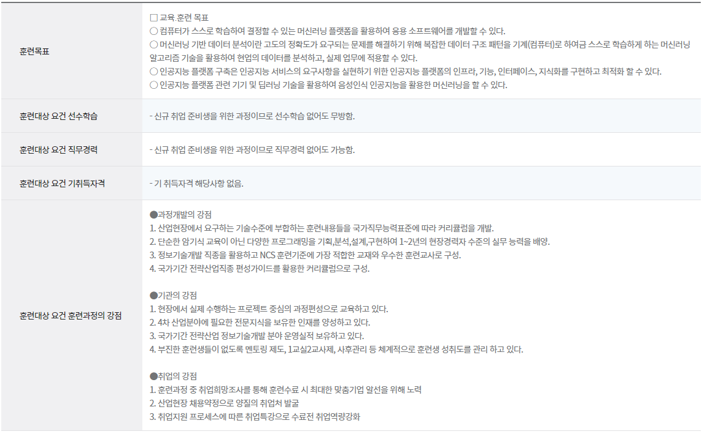

# 휴먼교육센터

## Python(파이썬), JAVA(자바)기반 AI활용 소프트웨어 개발 및 응용 과정
### 과정 소개
+ 기간 : 2022. 10. 04 ~ 2023. 04. 12
+ 훈련과정 개요

### 훈련 내용

+ JAVA
    + 2022.10.04 ~ 
    + 사용툴 : Eclipse
    + 

+ FrontEnd
    + 2022.
    + 사용툴 : vs code
    + HTML, CSS, JAVASCRIPT, JQUERY, AJAX 학습
    + 홈페이지 제작

+ SQL
    + 2022.
    + 사용툴 : Oracle SQL Developer
    + 대용량의 Dataset을 활용하여 Data Handling 실습
    + 테이블 생성 및 select, join 등을 활용한 DB관리

+ Spring
    + 2022.
    + 사용툴 : Eclipse
    + 